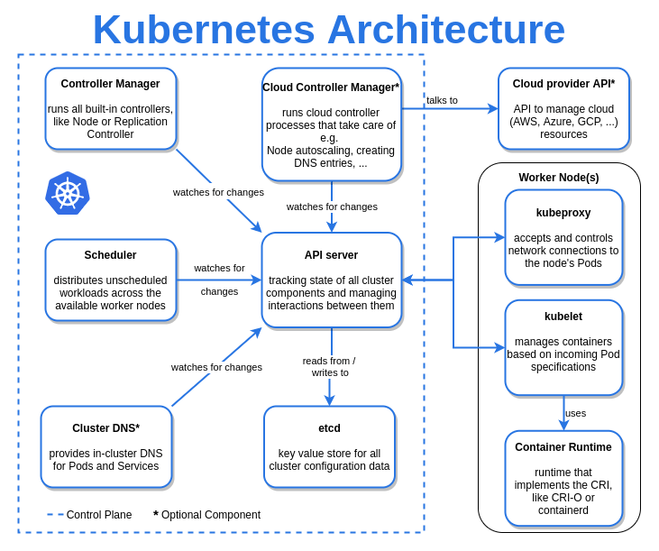

# kubernetes services
## cluster ip
*  in Kubernetes gives each service within the cluster a unique internal IP address. This address is only accessible from within the cluster itself, meaning you can't reach the service from outside. It's handy for letting different parts of your application talk to each other within the Kubernetes environment. For instance, your front-end can communicate with your back-end using ClusterIP
```
	apiVersion: v1
	kind: Service
	metadata:
	  name: my-backend-service
	spec:
	  type: ClusterIP # Optional field (default)
	  clusterIP: 10.10.0.1 # within service cluster ip range
	  ports:
	  - name: http
	    protocol: TCP
	    port: 80
	    targetPort: 8080
```
## nodeport
* in Kubernetes exposes services outside the cluster. It assigns a specific port on each node to the service, allowing external traffic to reach it. You access the service using the node's IP address and the assigned port. It's great for enabling external connectivity to your service. Just make sure to choose a port within the allowed range and avoid conflicts with other services.

```
apiVersion: v1
	kind: Service
	metadata:
	  name: my-frontend-service
	spec:
	  type: NodePort
	  selector:
	    app: web
	  ports:
	  - name: http
	    protocol: TCP
	    port: 80
	    targetPort: 8080
	    nodePort: 30000 # 30000-32767, Optional field
	
```
## loadbalancer
* in Kubernetes is an extension of NodePort that simplifies external access to services, especially when using a cloud provider. It automatically creates NodePort and ClusterIP services and integrates them with the cloud provider's load balancer. This load balancer routes external requests to your Kubernetes service. Each cloud provider has its own load balancer implementation, and the cloud provider manages load balancing. Whenever you need to expose a service externally, you create a new LoadBalancer to get an IP address. It's ideal for scenarios where you're hosting your Kubernetes cluster on a cloud platform and need straightforward external access to your services.

```
apiVersion: v1
kind: Service
metadata:
  name: my-frontend-service
spec:
  type: LoadBalancer
  clusterIP: 10.0.171.123
  loadBalancerIP: 123.123.123.123
  selector:
    app: web
  ports:
  - name: http
    protocol: TCP
    port: 80
    targetPort: 8080

```
 ExternalName

 * Services of type ExternalName in Kubernetes map a service to a DNS name rather than a typical selector like other service types. You specify these services using the spec.externalName parameter, which represents the DNS name you want to map the service to (e.g., foo.bar.example.com). When you use an ExternalName service, Kubernetes returns a CNAME record with the specified DNS name. Unlike other service types, no proxying is established. It's a simple way to map Kubernetes services to external DNS names without any additional routing or proxying configurations.
 ```
 apiVersion: v1
kind: Service
metadata:
  name: my-service
spec:
  type: ExternalName
  externalName: my.database.example.com
  ```
  # kuberenetes Architecture
  
  

  # camponents

  ## API Server
  * This is way to interact with k8s cluster 
* This is responsible for all the communications 
in k8s cluster 
## etcd
* This is memory of k8s cluster 
* Scheduler: Looks out for any new work and it does 
* Controller: This ensures desired state is 
maintained 
* Cloud Controller: This is component in k8s with 
cloud specific knowledge 
## Container runtime
 This is technology in which 
* your container is created (docker, rkt, containerd) 
## kube-proxy: 
* is responsible for networking 
## kubelet: 
* Agent that runs on nodes waiting for 
instructions from master and execute them.
## kubelet
*  Agent that runs on nodes waiting for 
instructions from master and execute them